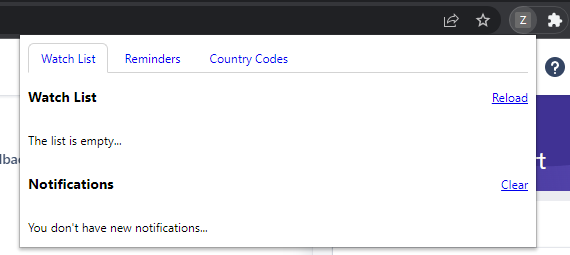
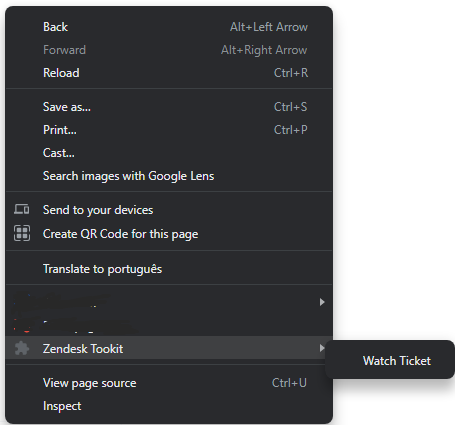

# Zendesk Toolkit
A quick&dirty chrome extension that allows Zendesk agents to:
- Create a ticket watch list, which notifies and shows you when there's any updates in the case
- Create reminders, if you have anything you want to be reminded off by a notification
- Search a country code for a given country. E.g., "+380 - Ukraine".

Extension:

Watching a ticket:

